# Uzo Food Tracking

A mobile-first PWA for tracking food inventory, recipes, and daily meal logging. Data is stored in Supabase, with optional AI-assisted recipe generation via OpenRouter.

## Features
- Manage pantry inventory with nutrition facts, prices, stock, and ratings
- Full-text search, rich filters, and tag management
- Create recipes with automatic cost and macro calculations
- Log meals by items (with costs and macros)
- Review nutrition insights and trends through analytics dashboard
- Configure personal goals and preferences in settings
- AI-assisted recipe ideas via OpenRouter
- Installable PWA with offline caching for assets
- Mobile-first responsive design optimized for touch interfaces

## Tech Stack
- **Frontend:** React 18, TypeScript, Vite
- **UI:** shadcn/ui (Radix UI) + Tailwind CSS + Mobile-first responsive design
- **Data/State:** TanStack Query (React Query v5)
- **Backend:** Supabase (PostgreSQL, SQL migrations, RPC, RLS policies)
- **AI:** OpenRouter with Hugging Face models
- **PWA:** vite-plugin-pwa with offline caching
- **Testing:** Vitest + Testing Library; Playwright for E2E
- **Documentation:** OpenAPI 3.1 specification

## Getting Started
1. Create a `.env` file in the project root from the `.env.example` file:
   ```env
   VITE_SUPABASE_URL=your-supabase-url
   VITE_SUPABASE_ANON_KEY=your-supabase-anon-or-publishable-key
   # Optional: required for AI features
   VITE_OPEN_ROUTER_API_KEY=your-openrouter-api-key
   # Optional: restrict sign-in to a specific email (defaults to owner)
   VITE_ALLOWED_EMAIL=you@example.com
   ```
2. Install dependencies
   ```sh
   npm install
   ```
3. Start the dev server
   ```sh
   npm run dev
   ```
   The application runs at `http://localhost:8080`.

## Database Setup (Supabase)
- Run SQL files in `supabase/migrations/*.sql` using the Supabase SQL editor.
- Optionally seed data via `supabase/seed.sql`.

## Testing
- **Unit/Component (Vitest):**
  - `npm test`: Run tests in watch mode
  - `npm run test:run`: Run tests once
  - `npm run test:ui`: Open the Vitest UI
- **End-to-End (Playwright):**
  - `npm run test:e2e`: Run E2E tests
  - `npm run test:e2e:ui`: Open the Playwright UI
- **Linting:**
  - `npm run lint`: Run ESLint
- **OpenAPI Validation:**
  - `npm run oas:validate`: Validate OpenAPI spec
  - `npm run oas:lint`: Lint OpenAPI spec with Redocly
  - `npm run oas:spectral`: Lint with Spectral
  - `npm run oas:all`: Run all OpenAPI checks

## Project Structure
```
├─ src/
│  ├─ pages/         # App pages (Index/Inventory, Recipes, Meals, Analytics, Settings, Tags, RecipeViewer)
│  ├─ components/    # UI and domain components (dialogs, cards, forms)
│  │  └─ ui/         # shadcn/ui component library
│  ├─ hooks/         # Data hooks (inventory, recipes, meal logs, tags, analytics)
│  ├─ lib/           # Supabase client, utils, constants, type mappers, calculations
│  └─ types/         # TypeScript type definitions (DB and app types)
├─ tests/            # E2E tests (Playwright)
├─ src/tests/        # Unit/component tests (Vitest)
├─ supabase/         # SQL migrations and seed data
│  └─ migrations/    # Database schema migrations (chronological)
├─ docs/             # API documentation (OpenAPI 3.1 spec)
├─ product-requirements/  # Design and architecture docs
└─ public/           # Static assets (PWA icons, screenshots)
```

- Path alias: use `@` for `./src` (see `tsconfig.json`)
- Mobile utilities: `use-mobile.tsx` hook for responsive logic

## Deployment
Build a production bundle:
```sh
npm run build
```

Preview builds locally:
```sh
npm run preview       # Default mode
npm run preview:dev   # Development mode
npm run preview:prod  # Production mode
```

The PWA service worker automatically registers in production builds (via `vite-plugin-pwa`).

## AI Setup
- Enable AI features by setting `VITE_OPEN_ROUTER_API_KEY` in `.env`
- The app uses OpenRouter to access Hugging Face models for recipe generation
- Relevant entry points:
  - `src/components/RecipeGeneratorDialog.tsx` - Main AI recipe generation interface
  - `src/lib/aiJson.ts` - AI response parsing and validation

If you don't set the API key, AI actions will show a friendly error and no requests are made.

## Screenshots

### Inventory Management
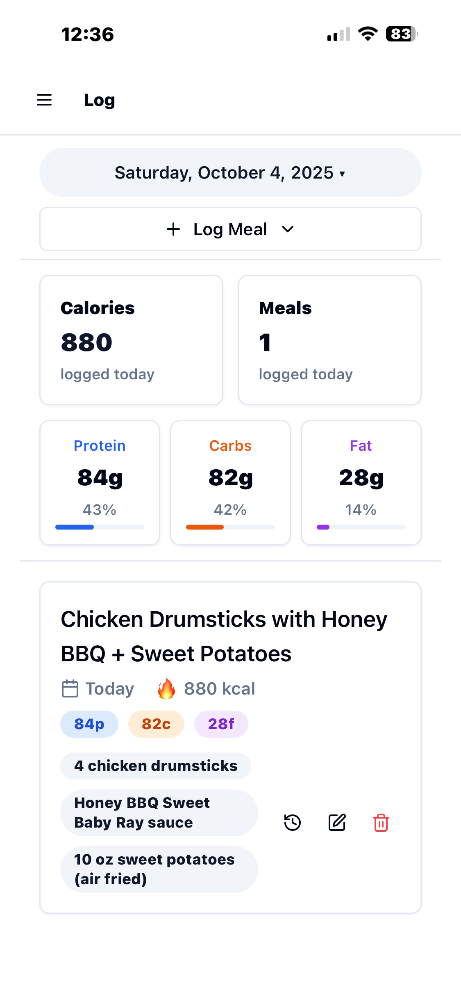 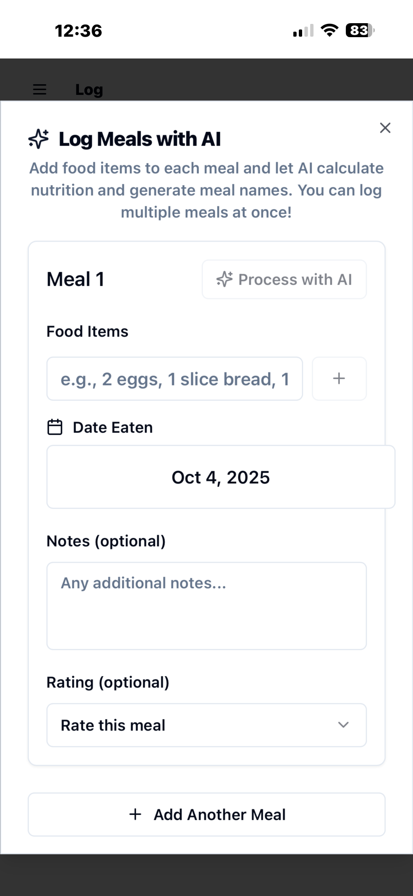 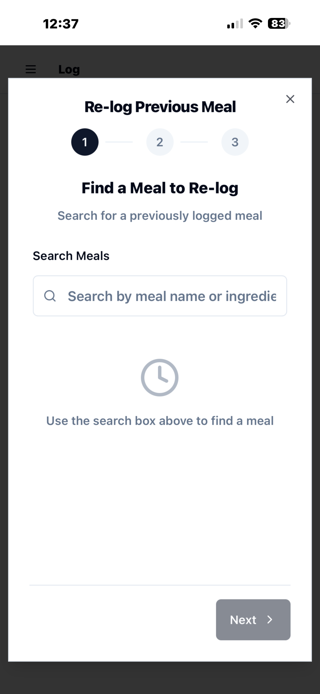

### Recipe Management
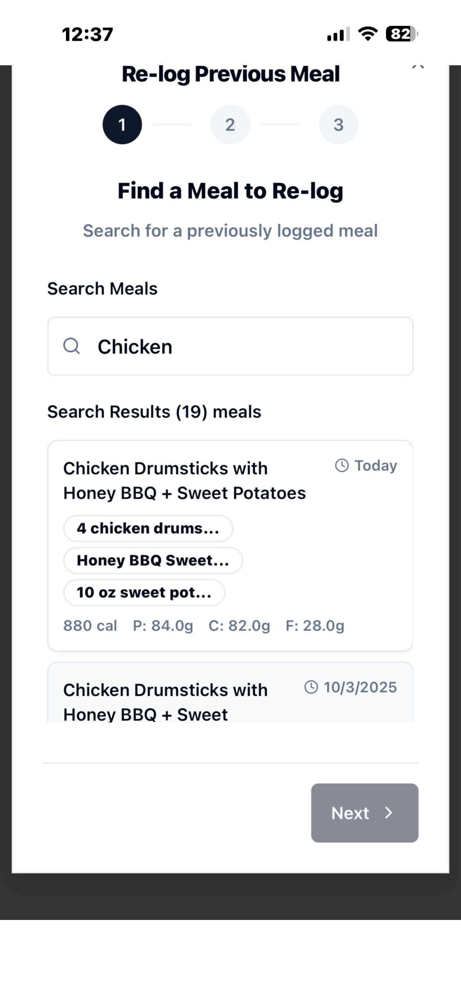 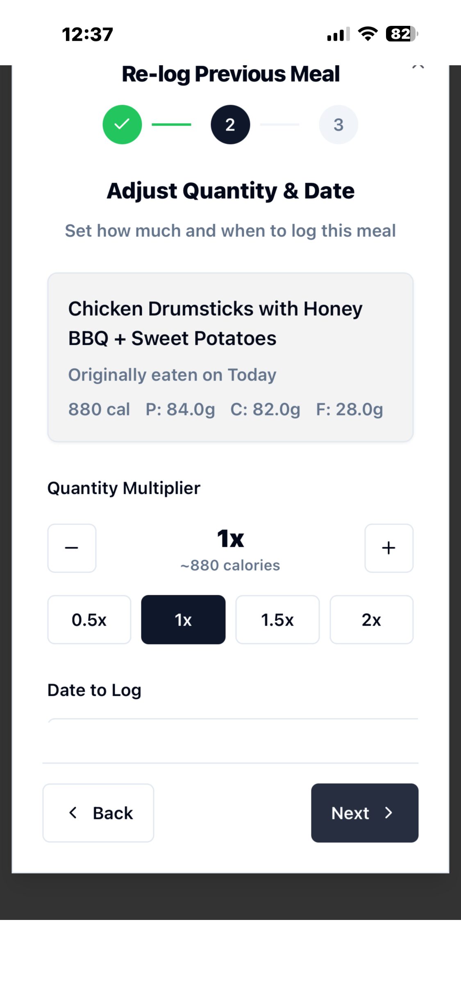 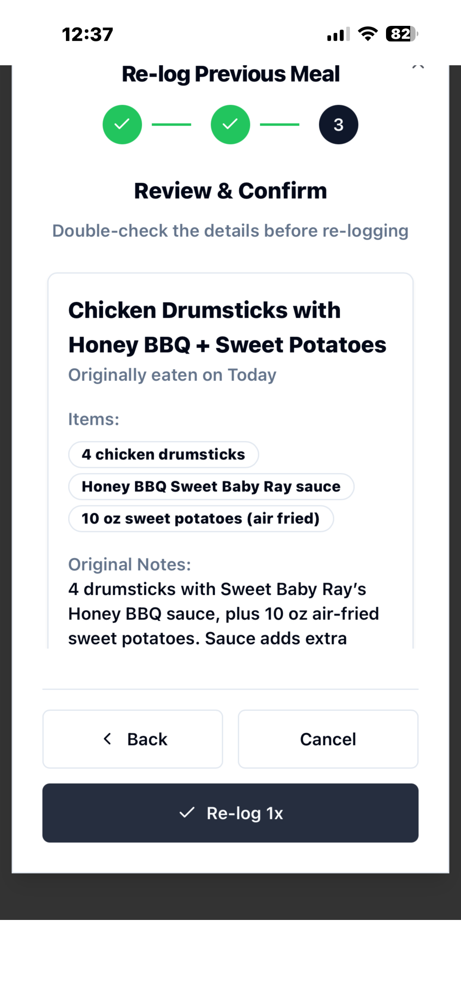

### Meal Logging & Analytics
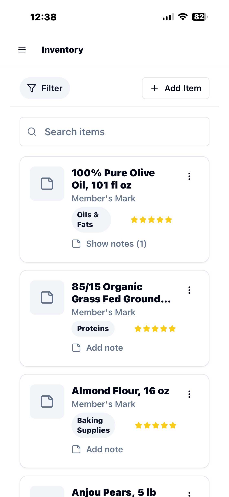 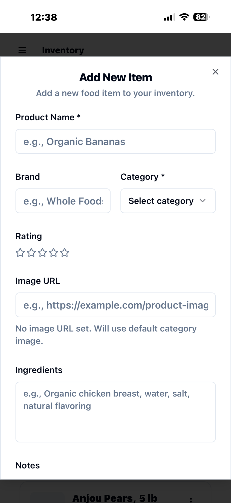 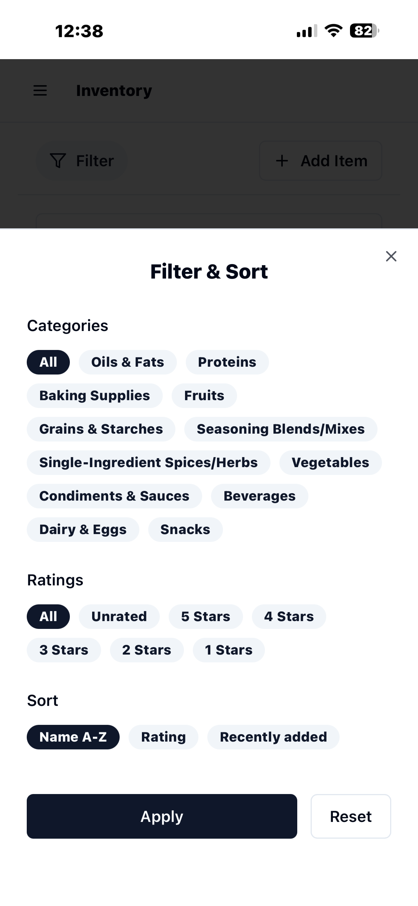

### Settings & Tags
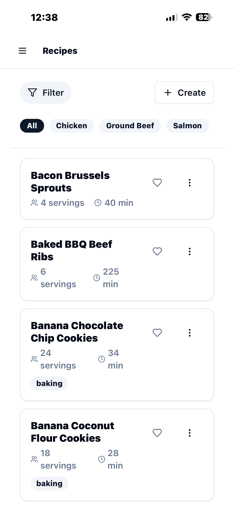 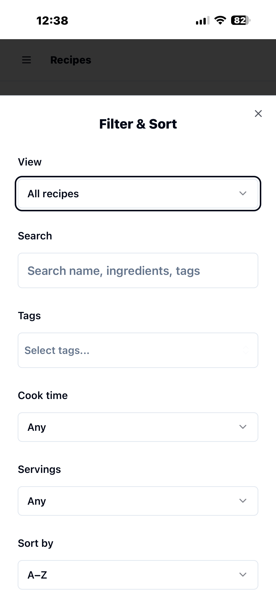

### AI Features
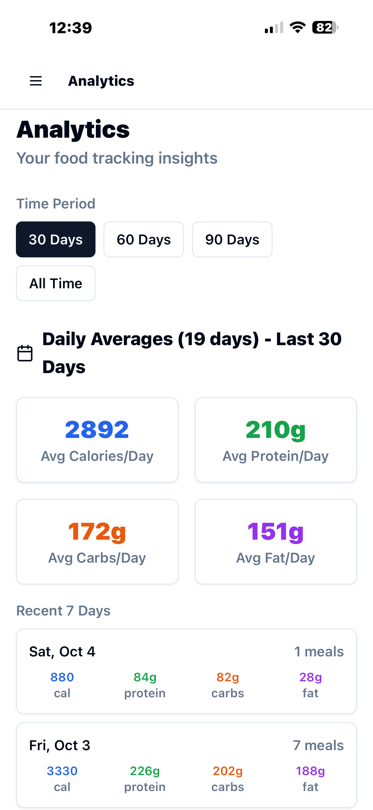 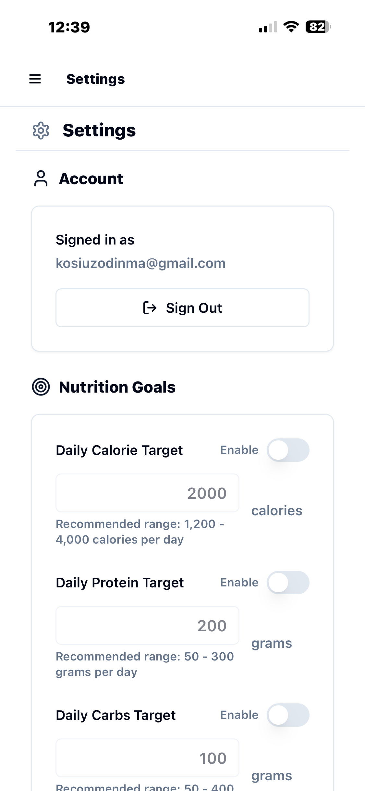

---

**PWA Assets:** `public/pwa-192x192.png`, `public/pwa-512x512.png`
