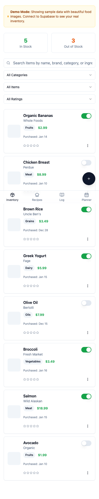
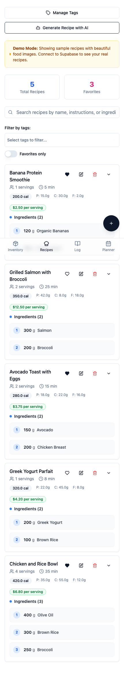
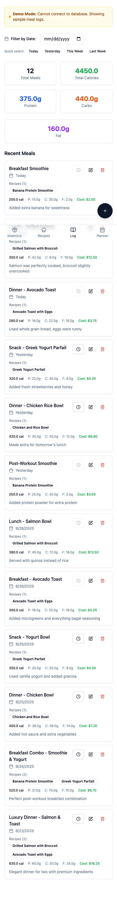

# Uzo Food Tracking

A mobile-first PWA for tracking food inventory, recipes, and daily meal logging. Data is stored in Supabase, with optional AI-assisted recipe generation via OpenRouter.

## Features
- Manage pantry inventory with nutrition facts, prices, stock, and ratings
- Full-text search, rich filters, and tag management
- Create recipes with automatic cost and macro calculations
- Log meals by recipe and/or individual items (with costs and macros)
- Review nutrition insights and trends through analytics
- Configure personal goals and preferences in settings
- AI-assisted recipe ideas via OpenRouter
- Installable PWA with offline caching for assets

## Tech Stack
- **Frontend:** React 18, TypeScript, Vite
- **UI:** shadcn/ui (Radix UI) + Tailwind CSS
- **Data/State:** TanStack Query
- **Backend:** Supabase (PostgreSQL, SQL migrations, RPC)
- **AI:** OpenRouter (e.g., microsoft/mai-ds-r1:free)
- **PWA:** vite-plugin-pwa
- **Testing:** Vitest + Testing Library; Playwright for E2E

## Getting Started
1. Create a `.env` in the project root:
   ```env
   VITE_SUPABASE_URL=your-supabase-url
   VITE_SUPABASE_ANON_KEY=your-supabase-anon-or-publishable-key
   # Optional: required for AI features (OpenRouter)
   VITE_OPEN_ROUTER_API_KEY=your-openrouter-api-key
   # Optional: restrict sign-in to a specific email (defaults to owner)
   VITE_ALLOWED_EMAIL=you@example.com
   ```
2. Install dependencies
   ```sh
   npm install
   ```
3. Start the dev server
   ```sh
   npm run dev
   ```
   Dev runs at `http://localhost:8080` (HMR on 8081). See `vite.config.ts`.

## Database Setup (Supabase)
- Run SQL files in `supabase/migrations/*.sql` using the Supabase SQL editor.
- Optionally seed data via `supabase/seed.sql`.

## Testing
- Unit tests: `npm test` (watch) or `npm run test:run`
- Test UI: `npm run test:ui`
- E2E tests: `npm run test:e2e` (Playwright)
- E2E UI: `npm run test:e2e:ui`
- Lint: `npm run lint`

## Project Structure
```
├─ src/
│  ├─ pages/         # Inventory, Recipes, Meals, Tags, Analytics, Settings
│  ├─ components/    # UI and domain components
│  ├─ hooks/         # Data hooks (inventory, recipes, meal logs, tags)
│  ├─ lib/           # supabase client, utils, constants, search
│  └─ types/         # App and DB types
├─ src/tests/        # Unit/component tests (Vitest)
├─ tests/e2e/        # Playwright tests
├─ supabase/         # SQL migrations and seed
├─ product-requirements/  # Design and architecture docs
└─ public/           # Static assets (PWA icons, images)
```

- Path alias: use `@` for `./src` (see `vite.config.ts`).

## Deployment
Build a production bundle:
```sh
npm run build
```
Preview locally:
```sh
npm run preview
```

PWA service worker registers in production builds (via `vite-plugin-pwa`).

## AI Setup
- Enable AI features by setting `VITE_OPEN_ROUTER_API_KEY` in `.env` (or `.env.local`).
- The app uses OpenRouter with the `microsoft/mai-ds-r1:free` route by default.
- See example prompts and parsing behavior in `sample_prompt_example.md`.
- Relevant entry point:
  - `src/components/RecipeGeneratorDialog.tsx` (single recipe generator)

If you don’t set the API key, AI actions will show a friendly error and no requests are made.

## Screenshots

Inventory


Recipes


Meal Log


PWA Icons: `public/pwa-192x192.png`, `public/pwa-512x512.png`

 
